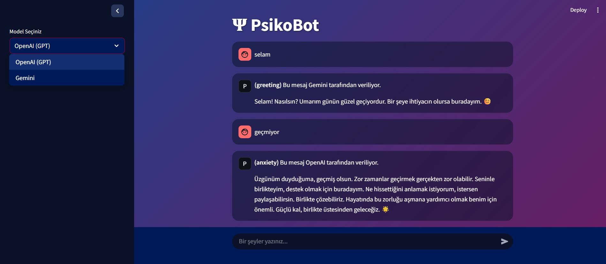

# Ψ PsikoBot

PsikoBot, kullanıcı mesajlarını duygu ve niyet bağlamında analiz eden, empatik ve psikolojik destek odaklı yanıtlar üreten bir yapay zekâ sohbet botudur.



Bu projede iki büyük dil modeli karşılaştırmalı olarak entegre edilmiştir:

**🔹 Gemini (gemini-2.0-flash)**  
**🔹 OpenAI (gpt-3.5-turbo)**


## 🧭 Desteklenen Niyet (Intent) Sınıfları

Uygulama, kullanıcı ifadelerini çeşitli psikolojik niyet kategorilerine ayırarak yanıtlarını bu sınıfa göre biçimlendirir. Desteklenen sınıflar şunlardır:

🔹 greeting: selamlaşma ve karşılamalar  
🔹 farewell: vedalaşma ifadeleri  
🔹 gratitude: teşekkür ve minnettarlık  
🔹 anxiety: kaygı, endişe ve huzursuzluk  
🔹 loneliness: yalnızlık hissi  
🔹 motivation: motive edici ve pozitif düşünceler  
🔹 stress: baskı, stres ve tükenmişlik ifadeleri  
🔹 rejection: reddetme, kabul etmeme tutumları  

Bu sınıflar, eğitilmiş TF-IDF + Lojistik Regresyon modeli tarafından tahmin edilmekte ve yanıt üretiminde bağlamsal rehber olarak kullanılmaktadır.


## 📂 Klasör Yapısı
```plaintext
chatbot_project/
│
├── app/ # Streamlit arayüzü ve giriş noktası
│ └── streamlit_app.py
│
├── models/ # Model cevap fonksiyonları
│ ├── gpt_model.py
│ └── gemini_model.py
│
├── data/ # Eğitim verileri
│ └── psikobot_veri_seti.csv
│
├── .streamlit/ # Tema ve ayarlar (opsiyonel)
│ └── config.toml
│
├── .env # API anahtarları
├── requirements.txt # Gerekli paketler
└── README.md # Bu dosya
```
## ⚙️ Kurulum ve Çalıştırma

1. Gerekli kütüphaneleri yükleyin:

```bash
pip install -r requirements.txt
```
2. .env dosyasına API anahtarlarınızı girin:
```bash
OPENAI_API_KEY=sk-...
GOOGLE_API_KEY=AIza...
```
3. Uygulamayı başlatın:
streamlit run app/streamlit_app.py

```bash
🎯 Özellikler
- 🌐 GPT ve Gemini arasında kolay geçiş
- 💬 Gerçek zamanlı sohbet geçmişi
- 🧠 TF-IDF + Lojistik Regresyon ile niyet tahmini
- 📊 Model metriklerinin terminale yazdırılması
- 🎨 Özel temalı görsel arayüz
```

